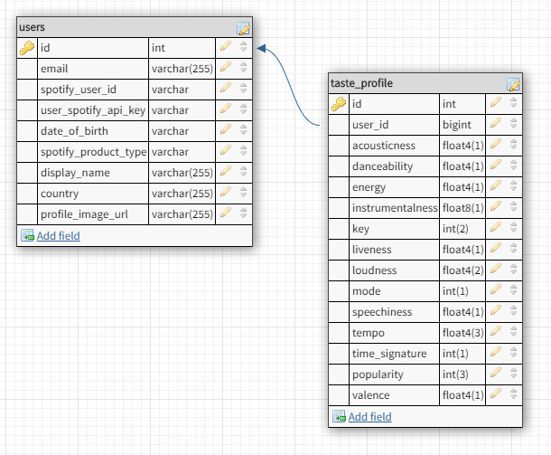

# Music Meteorologist Frontend

Frontend Deployment (Coming Soon)

[Visit Backend](https://music-meteorology-development.herokuapp.com/) (See endpoints below)

Music Meteorologist is a fullstack web application that has been built during the Labs15 (1st August 2019 - 30 September 2019) by
[LambdaSchool](https://lambdaschool.com/) students. Each student fulfills a role in the project to collectively build the application. (Roles listed below)

Music Meteorologist provides a web application where users can play a guessing game and get to know themself better. A sophisticated Machine Learning model will try to predict better than the user itself if a certain music song will be liked or not. For that a lot of different characteristics of a songs are considered. At the end the user can revisit the assessment of the model and give feedback about its correctness. To deliver this experience a Node.JS Backend and a React.JS Frontend were built.

## Built With

- [JavaScript](https://en.wikipedia.org/wiki/JavaScript) - Language used to make the webpage interactive
- [Node.js](https://en.wikipedia.org/wiki/JavaScript) - JavaScript runtime for executing JavaScript at the server outside the browser
- [Express.js](https://expressjs.com/) - Lightweight web framework to bootstrap Node.js APIs
- [PostgreSQL](https://www.postgresql.org/) - An advanced object-relational database for production environments
- [Knex.js](https://knexjs.org/) - A SQL query builder that helps abstracting migrations and DDLs for different database types into a single coherent structure
- [JWT](https://jwt.io/) - JSON Web Token for authorization and client side tokens for security
- [Moment.js](https://momentjs.com/) - Lightweight Module to handle dates and times
- [Supertest](https://www.npmjs.com/package/supertest) - A test module for HTTP assertions
- [JEST](https://jestjs.io/) - Simple JavaScript testing framework

## Endpoints

All endpoints are also documented in the [automated Postman documentation](https://documenter.getpostman.com/view/8038461/SVfJUXBn).

The endpoints URLs are environment specific and contain a word that reflects the project/environment on Heroku.

### General

##### <span style="color:blue">GET [API RUNNING]</span>

```
https://music-meteorology-development.herokuapp.com
https://music-meteorology-production.herokuapp.com
```

- JWT protected (header) :x:
- payload (body) :x:

<span style="color:red">API Running Response (200 OK)</span>:

```
Welcome to the [DB_ENV] environment API of Music Meteorologist!
```

### USERS

The base url for user endpoints is **/v1/users**

##### <span style="color:blue">GET [ALL USERS]</span>

```
https://music-meteorology-development.herokuapp.com/v1/users
https://music-meteorology-production.herokuapp.com/v1/users
```

- JWT protected (header) :x:
- payload (body) :x:

<span style="color:red">Get Users Response (200 OK)</span>:

```
{
    "users": [
        {
            "id": 1,
            "email": "firstname.lastname@pm.me",
            "spotify_user_id": "j3553svv444by33k1dqo189v",
            "user_spotify_api_key": "BQCYlQlNNQRvqFCeNL_XyPzElQoTf66R3lyaHnEHkshqk92oDcGWLrlGDFyGMoCVNg_t6oFpnbE8ELSc44sdsfAwl_DucbDqp7xUrR4W2eDdqv3Ze1Ph7r0g5ITOhno0v9ZSo958LhiEyCi3-5h5jiZQrlg9bgSfDaoj7yaGSnZsyXNM9mJjfBkzXhOfC5Fr45ohiS64Hi_p_pgw",
            "date_of_birth": "1990-08-09",
            "spotify_product_type": "premium",
            "display_name": "Firstname",
            "country": "DE",
            "profile_image_url": null
        },
        {
            "id": 21,
            "email": "firstname.lastname2@pm.me",
            "spotify_user_id": "j3553svv444gdfdfdf565tzv",
            "user_spotify_api_key": "BQCYlQlNNdfdFSR54XyPzElQoTf66R3lyaHnEHkshqk92oDcGWLrlGDFyGMoCVNg_t6oFpnbE8ELSc44sdsfAwl_DucbDqp7xUrR4W2eDdqv3Ze1Ph7r0g5ITOhno0v9ZSo958LhiEyCi3-5h5jiZQrlg9bgSfDaoj7yaGSnZsyXNM9mJjfBkzXhOfC5Fr45ohiS64Hi_p_pgw",
            "date_of_birth": "1995-02-10",
            "spotify_product_type": "premium",
            "display_name": "Firstname",
            "country": "EN",
            "profile_image_url": null
        }
    ]
}
```

#### JSON Responses

For JSON responses there are 4 different content types available:

- A JSON containing a direct resource **{ "id": 1, "email": "test@test.com" }** or a JSON containing a resource **{ "resource": [{"id": 1, "email": "test@test.com"}, {"id": 2, "email": "test2@test.com"}] }** or a JSON containing a message string **{ "message": "text" }** means that the request was successful and data is returned to the client. So the request **happened**.
- A JSON containing a { "**info**" : "text" } means that the request was semantically not useful as for example a deletion of no elements or search for no existing user. It **happened** but was useless.
- A JSON containing a { "**warning**": "text"} means that something went wrong because of how the request was shaped and it **did not happen**.
- A JSON containing a { "**error**" : "text" } means that something went wrong internally during the request and it **did not happen**.

#### HTTP Status Codes

Next to the custom JSON response system also [HTTP Status Codes](https://http.cat/) were used.

## Installation

### Local PostgreSQL Installation

Download and install the correct [Installation Package](https://www.enterprisedb.com/downloads/postgres-postgresql-downloads) for your OS.

During installation set a master password and keep it safe.

Start the PostgreSQL Shell (PSQL) and press multiple times enter until password is prompted. The password was set during the installation of PostgreSQL.

Create a new user by inserting this command and use a password of your choosing. Don't forget about the closing ; otherwise the command is incorrect.

```
CREATE ROLE music WITH LOGIN PASSWORD 'iamanunsecurepassword';
```

Set the newly created user to a superuser by inserting this command.

```
ALTER ROLE music superuser createrole createdb replication bypassrls;
```

Create a new database that can be used for the local development installation of the music meteorologist application. For that open pgadmin4, uncollapse servers, select a existing server and rightlick to create a new database.

The new database could be named music_dev for example. Make sure to use that name in the .env file as environment variable.

Rightclick on the database and click on Properties to assign a user to the database. Make sure to select the newly "music" user as the owner of the database.

### Environment Variables

This application makes usage of environment variable to set the PORT the server listens on, to connect to the database and to let the application know in which environment it currently runs so it can behave accordingly.

On Heroku the Config Vars accepted configurations are:

```
DATABASE_URL  provided postgres connectioN URI
PORT          5000
DB_ENV        development OR deployedDevelopment OR staging1 OR staging2 or production
```

For a local installation and connection to a local PostgreSQL database accepted environmental variables are:

.env file

```
PORT=5000
DATABASE_DB=your_postgres_database_name
DATABASE_USER=your_postgres_database_user
DATABASE_PASSWORD=your_postgres_database_password
DB_ENV=development
```

### Installing the Application

This application required a installation of [Node.js](https://nodejs.org/en/download/) to make JavaScript executable on the server side.

You can check with node -v in the terminal if Node.js was installed and which version you got.

Simply run this command in terminal on the folder level where package.json is located.

```
npm i
```

Now a package.lock and node_modules folder should be present containing all external modules and dependencies to start up the application.

To start the application simply run this command in command line on the same folder level where package.json is located.

```
npm run development
```

To start the server in on a remote server like Heroku a different start command is used:

```
npm start
```

## Architecture and Workflow



The application is split into two tables. One User can have many taste_profiles. One taste_profile can have one user. This is because a user can like different kind of music like Metallica and Frank Sinatra at the same time. By capturing different tastes a more complete image of the users musical taste can be delivering to the datascience model

For the Backend Node.JS with Express.JS was used to bootstrap the server and thus the endpoints. For the database in development, staging1, staging2 and production environment locally and remotely PostgreSQL was used. For authorization and restriction of endpoints JWT between the Frontend client and the Backend was used. The deployment was made on Heroku where the environmental variables are configured and tweaks via Heroku Cli were made to execute knex migrations and seeds.

For testing of the server and endpoints supertest and JEST was used.

## Project Requirements and Documentation

Coming Soon

## Authors

**Role: Team Lead**

- **[Daniel Starling](https://github.com/Dstar4)**

**Role: Full Stack Web Developer**

- **[Ben Feole](https://github.com/Zurglots)**
- **[Sascha Majewsky](https://github.com/SaschaWebDev)**
- **[Justin Chen](https://github.com/justiny2c)**
- **[Rushi Arumalla](https://github.com/rushi444)**
- **[Jean Lafontant](https://github.com/jrl508)**

**Role: Data Scientist**

- **[Tom Higgins](https://github.com/Higgins2718)**

## License

This project is licensed under the MIT License - see the [LICENSE](LICENSE) file for details
